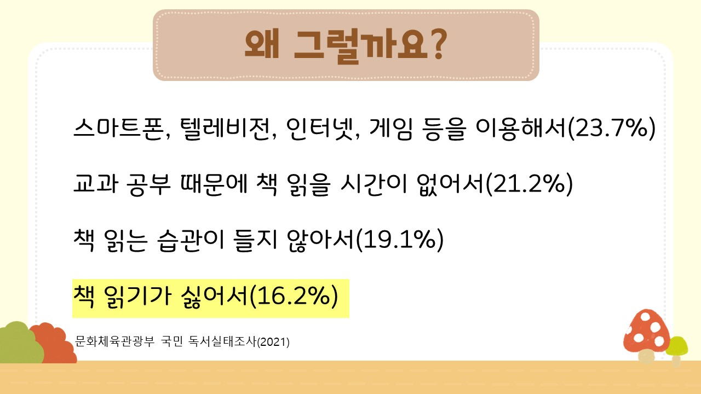
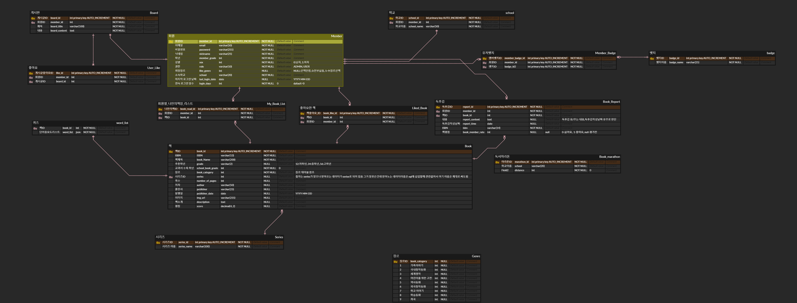

# 어린이를 위한 도서 추천 서비스, KEAD

## 서비스 url

http://j10c106.ssafy.io

## 기획 배경 및 프로젝트 개요

### 기획 배경 영상

https://youtu.be/Ycb8Vcof1Fw
  
한국사회의 문맹률 <b>1%</b>

그러나

실질적인 문맹률을 의미하는

한국 학생들의 사실과 의견 식별률 <b>25.6%</b>
  

이 수치는

OECD 평균 사실과 의견 식별률인 <b>47%</b>의 절반 정도밖에 미치지 못하는 수치. 
 왜 그럴까?
  

 
 
그래서 책에 흥미를 가지고 읽을 수 있게 도와주는 서비스가 필요하다.

## 팀원 소개 및 역할 분담

| 이름   | 역할                                |
| ------ | ----------------------------------- |
| 서민주 | 팀장, Back-End(리더), Front-End     |
| 문철환 | CI/CD                               |
| 선상범 | Big Data(리더), Back-End, Front-End |
| 위세영 | Big Data, Back-End, Front-End       |
| 천승현 | Back-End, Front-End(리더)           |

## 기술 스택 및 개발 환경

### FrontEnd

Visual Studio Code: 1.85

Router version : react-router-dom@6.22.3

React 18.2.0

Zustand 4.5.2

axios@1.6.8

### BackEnd

Java 17

Java Springboot 3.2

Server: AWS EC2 Ubuntu 20.04.6 LTS

### DB

MySQL: 8.0.35

### Data

Visual Studio Code: 1.85

Python 3.12

Pandas

Flask

### CI/CD

Docker **25.0.4**

Jenkins **2.451**

Nginx **nginx/1.18.0 (Ubuntu)**

## 주요 기능

1. KNN 알고리즘을 이용한 책 추천 시스템

- 나와 선호 성향이 비슷한 유저의 선호 시스템을 이용해서 해당 유저의 선호 체계를 기반으로 추천해 줍니다.
- 내부에 평점이 있는데 이 평점이 0에서 1 사이의 값입니다. 여기에 100을 곱해서 추천율이 나오는 방식으로 진행됩니다. 

2. TF-IDF 알고리즘을 이용한 퀴즈 생성 기능

- TF-IDF 알고리즘이란?
  - 단어의 빈도와 역빈도를 사용하여 각 단어들마다 중요한 정도를 가중치로 주는 방식
  - `그리고`와 같이 많은 책에서 나오는 단어는 역빈도를 통해 중요도 가중치를 낮추고, 해당 문서에서만 나오는 단어에는 빈도를 이용해 중요도 가중치를 높이는 방식으로 중요도 판단.
  - 해당 퀴즈를 통해 이용자의 책에 대한 흥미를 높여줌.

3. 독후감 작성 기능

- 독후감 작성한 책은 KNN 알고리즘 추천 시스템에 반영됩니다. 

## 산출물

### api 명세서

https://western-approach-80b.notion.site/API-7abe55e5a16d41828200b4bbcc353b86

### erd

### 요구사항 명세서

https://western-approach-80b.notion.site/22ee33dc909b4aedbbd5d74c581181ed?v=9f5ddcf27c0b486eb76a034bd49ac1a8&pvs=74

### 기능 명세서

https://western-approach-80b.notion.site/86bdeb5b222a4b258294d2a28b3dd65a?v=c92e1641136a4d9eb292b89d4e8144d8&pvs=74

### figma

https://www.figma.com/file/rI5N6iYZeS6RvyWlxyZD6Q/Untitled?type=design&node-id=0%3A1&mode=design&t=5hFEkvV0wb5wzV7W-1

### 발표 장표

static 디렉토리의 `KEAD_최종발표.pdf` 파일입니다.

### 포팅 매뉴얼

https://western-approach-80b.notion.site/4733d5e20c2c401993fceee586fdb8f5?pvs=74 
pdf 파일로 `exec` 폴더에 들어가 있습니다.
